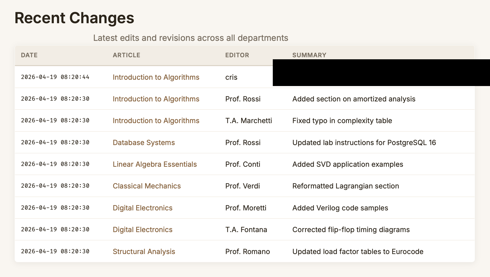

# CTF Writeup — SQL Injection (Department Wiki)

## Description

A university internal wiki exposes a search feature that allows staff to look up course articles. The search input is vulnerable to stacked SQL injection.

## Source Code Analysis

The challenge provides `app.js`, which reveals a critical flaw in the `/search` route:

```javascript
const sql = "SELECT ... WHERE a.title LIKE '%" + q + "%' OR a.content LIKE '%" + q + "%' ...";
db.exec(sql);  // vulnerable — string concatenation, supports multiple statements

const results = db.prepare("SELECT ... WHERE a.title LIKE ? OR a.content LIKE ?")
  .all('%' + q + '%', '%' + q + '%');  // safe — parameterized query, results shown to user
```

The code runs `db.exec(sql)` with raw user input (vulnerable), but then discards its output and re-runs the same query via a safe parameterized statement. This means the injection is **blind**: arbitrary SQL can be executed, but its output is never returned directly to the user.

## Where the Flag Is

Also visible in `app.js`:

```javascript
insConfig.run('admin_token', FLAG);
```

The flag is stored in the `internal_config` table under the key `admin_token`.

## Exploitation Strategy

Since `db.exec()` supports multiple semicolon-separated statements, a **stacked query** can be injected to copy the flag value into a table whose contents are displayed in the UI.

The `/revisions` page shows the last 20 entries from `revision_log`, making it the perfect exfiltration target.

### Step 1 — Probe the injection point

Submitting `networking' OR 1=1` in the search box returns a syntax error, confirming unsanitized input reaches `db.exec`.

### Step 2 — Inject a stacked query

The following payload is submitted in the search field:

```
%'; INSERT INTO revision_log (article_id, edited_by, summary) SELECT 1, 'cris', value FROM internal_config WHERE key='admin_token'; --
```

This closes the original `LIKE` clause and appends a second `INSERT` statement that reads the flag from `internal_config` and writes it into `revision_log.summary`.

### Step 3 — Retrieve the flag

Navigating to `/revisions` shows the injected row at the top of the list. The `summary` column contains the flag value extracted from `internal_config`.

