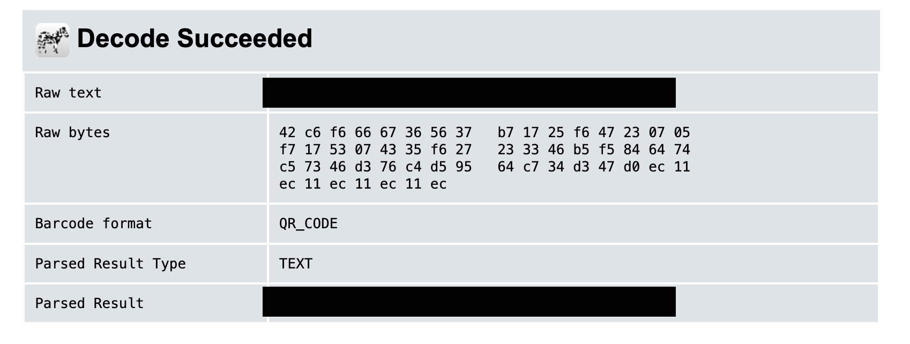

# QRDrop — Write-up

**Category:** Command Injection  
**Flag:** `offsec{REDACTED}`

---

## Description

QRDrop is a server-side QR code generator. Users paste a URL into a form, and the server generates a scannable PNG. The challenge hints that the server-side conversion can be abused to do more than just generate QR codes.

---

## Source Code Analysis

Reading `app.js`, the vulnerable line is:

```javascript
const cmd = `qrencode -t PNG -o ${outputPath} -s 8 -m 2 '${url}'`;
exec(cmd, { timeout: 5000 }, ...);
```

The user-supplied URL is wrapped in single quotes and interpolated directly into a shell command via `exec()`. Single quotes in bash prevent `$()` and backtick expansion, but only **within** them. By injecting a closing single quote, we can escape the quoted context and introduce arbitrary shell syntax.

---

## Exploit

Payload submitted in the URL field:

```
'$(cat /flag.txt)'
```

This transforms the executed command into:

```bash
qrencode -t PNG -o /tmp/qrcodes/<uuid>.png -s 8 -m 2 ''$(cat /flag.txt)''
```

The shell evaluates `$(cat /flag.txt)`, and the contents of `/flag.txt` are passed as the data argument to `qrencode` — encoding the flag **inside the generated QR code image**.

Scanning the resulting PNG with any QR decoder reveals the flag.

This is the result using https://zxing.org as QR decoder:


---

## Lesson Learned

Never interpolate user input directly into a shell command string. The fix is to avoid `exec()` with shell interpretation entirely and use `execFile()` with an explicit argument array instead, which bypasses the shell and makes injection impossible regardless of input content.